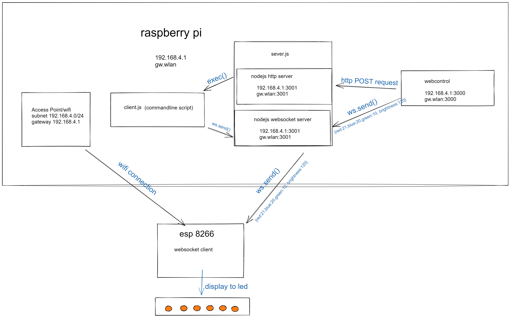

# mooled

> simple led-websocket project with esp8266(Wemos d1 r2) and raspberry pi


## How

- raspberry as an access point and websocket server
    - access point act as router(give ip/dns) and gateway for
    - websocket server to control esp board 
- esp8266 as websocket client
    - accept and parse message from websocket server



## Requirement
### Hardware 

- WEMOS D1 R2
- Raspberry Pi 4 
- Neopixel Led

### Software/Library

#### Raspberry Pi 4

- [hostapd (as software accesspoint)](https://www.raspberrypi.org/documentation/configuration/wireless/access-point-routed.md)
- dnsmasq (as dhcp server)
- nodejs
    - [ws (as websocket server)](https://github.com/websockets/ws)
    - [react(as webcontrol)](https://reactjs.org)

#### WEMOS D1 R2

- esp8266 wifi
- [arduino json (parsing websocket json message)](https://arduinojson.org/v6/example/parser/)
- [arduino websocket (connect to nodejs websocket)](https://github.com/gilmaimon/ArduinoWebsockets)

## Project Structure
```
.
├── esp8266
├── README.md
├── resources
├── web-controll
└── websocket
```
- [esp8266:](https://github.com/violeine/mooled/tree/main/esp8266) arduino led code
- [web-control:](https://github.com/violeine/mooled/tree/main/web-control) simple web interface with reactjs
- [websocket:](https://github.com/violeine/mooled/tree/main/websocket) websocket+http server with ws and express.js and various script to control arduino led
## Resources

- [neopixel documentation](https://learn.adafruit.com/adafruit-neopixel-uberguide/arduino-library-use)
- [led](http://arduino.vn/bai-viet/530-lam-nao-de-dieu-khien-led-rgb-led-3-mau)
- [websocket](https://hocarm.org/esp8266-web-server-va-client-voi-web-socket/)
- [esp8266 pin](https://randomnerdtutorials.com/esp8266-pinout-reference-gpios/)