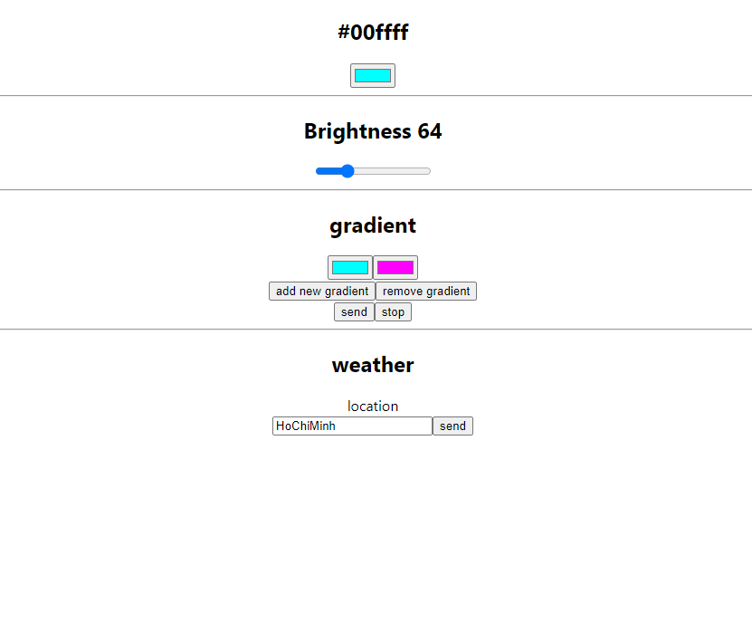

# Web interface

web interface đơn giản để tương tác với websocket và arduino led

## Colors

Đổi màu realtime thông qua websocket

## Brightness 

Đổi độ sáng realtime thông qua websocket

## gradient

Tạo các bước màu gradient và gửi post request để loop, thông qua `websocket/client.js`

## weather

Chọn địa điểm và gửi post request để update màu theo thời tiết thông qua `websocket/weather.sh`

